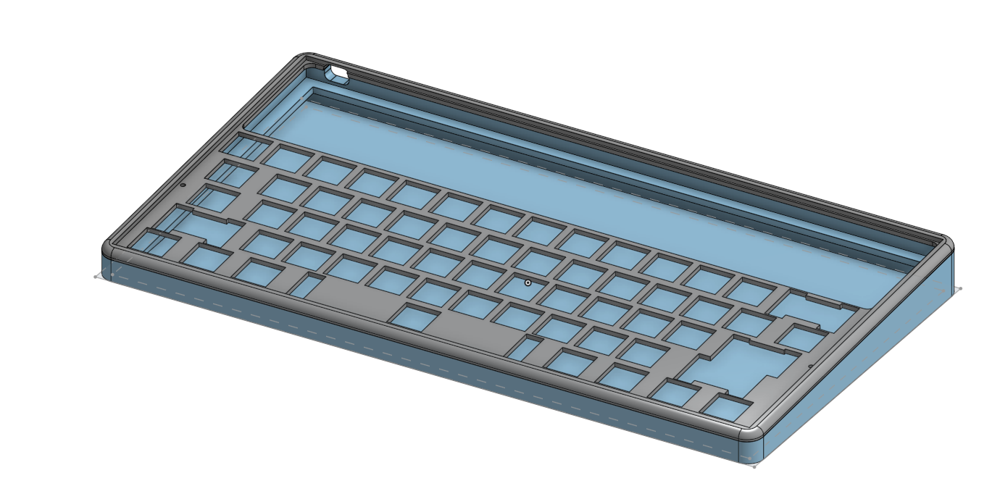
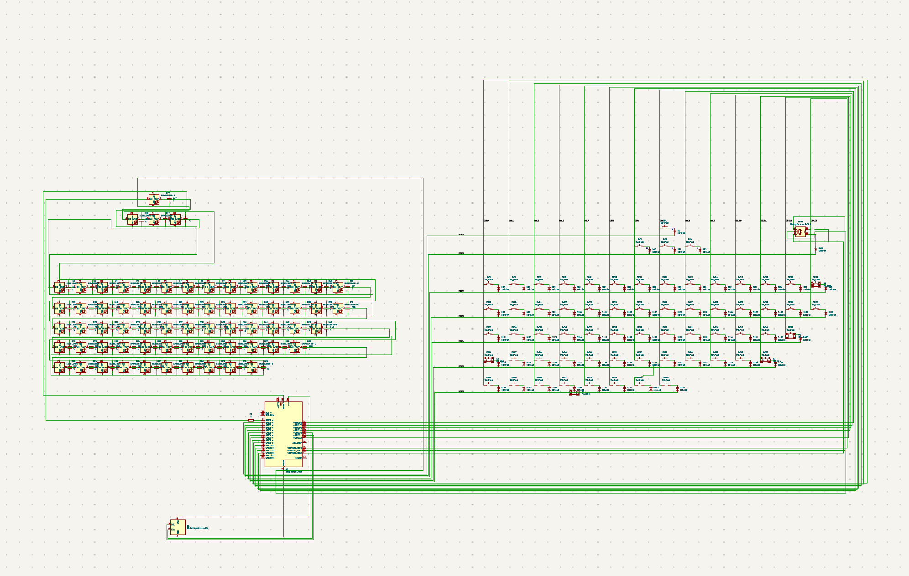
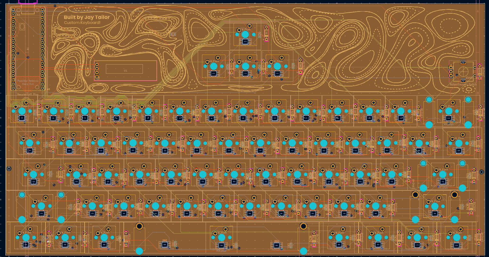

# The Megaboard

The megaboard is a custom 60% keyboard that has 65 keys in total, and has many unique functions that truly make this project a one-of-the-kind.

I built this project to participate in [Hack Club's Keeb YSWS](http://keeb.hackclub.com/), and fell in love with the development of keyboards very quickly after I started!
## Features
- Amazing 3D printed case
- 0.91" OLED for animations, startup, and for other tools, such as WPM, and Caps Lock
- SK6812 Mini-E LEDs for under-key glow
- EC11 Rotary Encoder to control volume, scroll through pages, or press down to mute/unmute your zoom meeting
- 65 Akko V3 Cream Yellow Pro keys for your satisfying typing experience needs :D (Cheap and sounds like heaven)
- Topographic look all-around (Part of the PCB is exposed)
w
## CAD Model
All the parts of this project fit together using 2 m2.5 screws.
It has 2 seperate printed pirces, one to be the main base, and the other one to cover the electronics.

Made in OnShape.

## PCB
Here's my PCB! it was made in KiCad. Some footprints and schematics were from marbastlib. I made the silkscreen in Adobe Illustrator.
#### Here is my schematic

#### Here is my PCB

The PCB has 4 copper layers, and all the parts that are needed are part of the PCB design. I think in retrospect, I should have moved the arrow keys to the bottom of the PCB, instead of it being at the top.

## Firmware overview
This hackpad's firmware has been designed in [QMK](https://qmk.fm/). It is a powerful, yet simple way to design keyboards that have a lot of useful functions!
- The rotary encoder controls the volume of the computer, and when you hold FN, you can scroll. When you press the encoder, it will mute/unmute your zoom call.
- The 65 keys all perform different functions that can be adjusted by simply changing it's function in keymap.c.
- The OLED starts off with a startup animation, and then after, it turns into a cat! Specifically, the Bongocat!! <b>Credits to [nwii's bongocat](https://github.com/nwii/oledbongocat) for the source code!</b>
- All keys have SK6812 Mini-E LEDs beneath them and when you press a key, its LED will light up in a reactive typing way. Take a look [here](https://youtu.be/7f3usatOIKM?t=229)!

I might add more in the future, however, that's it for now!

## BOM
Here is everything that you will need to make the megaboard:
Click [here](https://docs.google.com/spreadsheets/d/1aInlIyzgglzUiH9fcOGwBJfbiqagTssbSa5kihXWXrg/edit?usp=sharing)

## Thank you!
Thank you for taking a look! This was a huge undertaking to make this entire project, and I spent over 50 hours to make this!

Especially, thank you to [Hack Club](https://hackclub.com/) for inspiring me to make this project, and thank you to [nwii's bongocat](https://github.com/nwii/oledbongocat) animation for part of the OLED!
