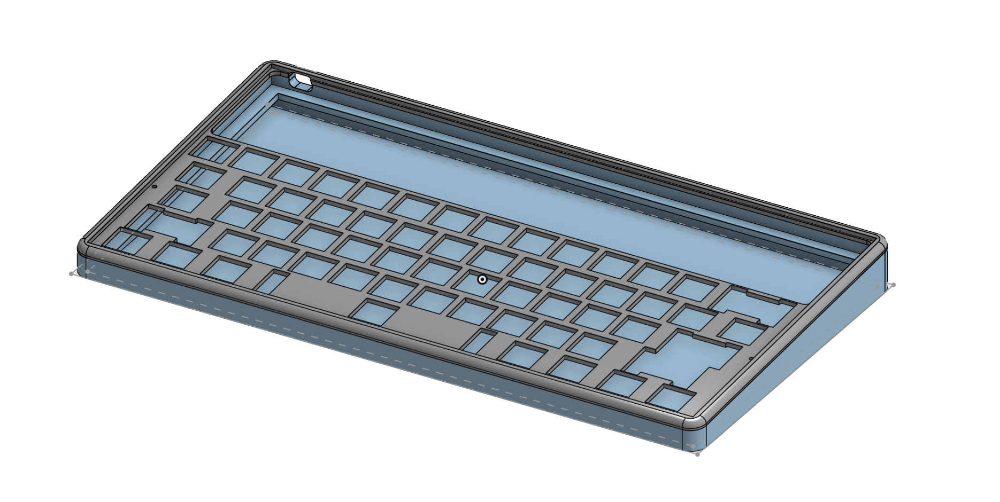
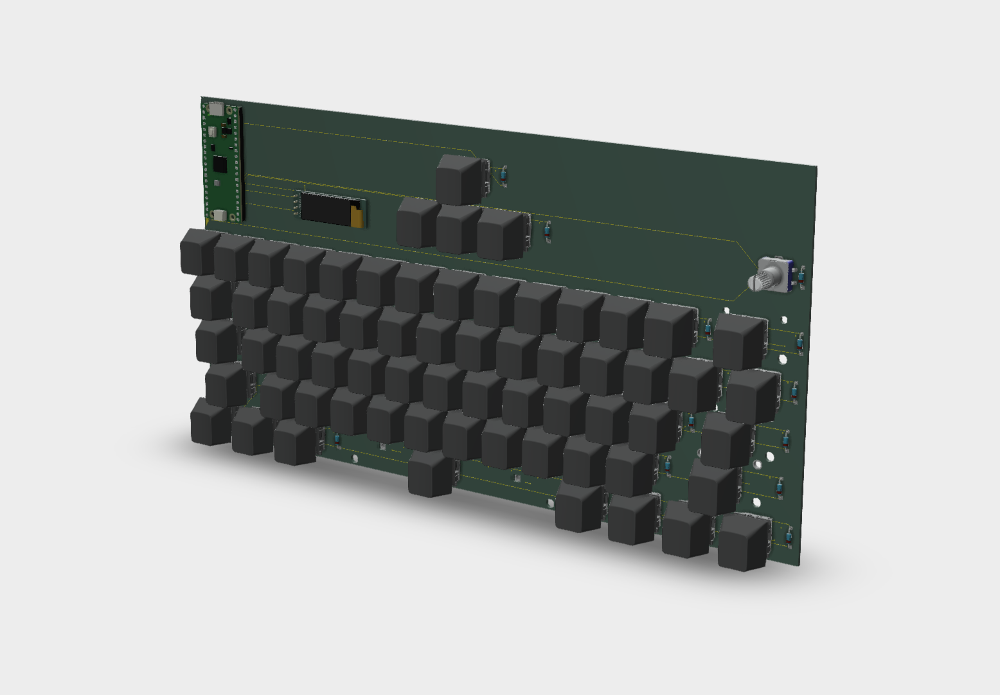
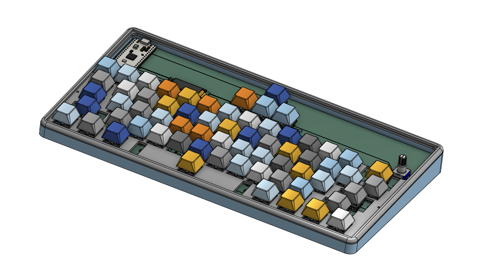

# The final shell!
Today, I finished up the shell for the keyboard! This was really fun to make, and it took ~w2.5 hours to make the entire thing.

Here is what the shell looks like without the PCB:
j

Here is what the PCB looks like without the shell:

Here is what the shell looks like with the PCB:

